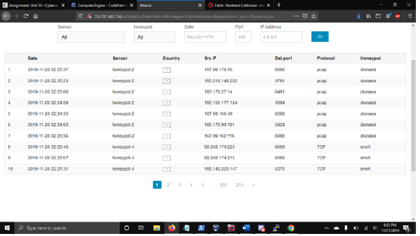

# Wk-10-Honeypot
WK 10 writeup

  This experiment was my first foray into cloud servers. While setting up the initial Google Cloud project I found many issues with the Google Cloud SDK command line interface which made it unsuitable for sole execution of the setup. The first problems I faced was the fact that Google failed to include necessary arguments in order to accept Terms of Service which stopped the entire setup. This could only be resolved by using the browser interface. In addition, it was not possible to authorize billing in the console. Ultimately, the frequent issues made the command line nearly unusable. 
  If I were to give one piece of advice to anyone attempting to begin this project and finish setup in the most efficient way possible, I would advise them to use the browser interface for everything except setting firewall rules. VM setup is reasonably quick in the browser and it bypasses the other issue I had in the console that caused the image to not be able to be copied from the API.

  Once the setup was complete the rest of the project went rather smoothly. Setting up the MHN Admin VM as well as the Honeypot VMs. MHNs interface for creating honeypots is very efficient and easy to use. For the initial honeypot I used the recommended Dionaea honeypot. 
  I ran into an issue of the honeypot VM consistently having connection errors after about 10 minutes. In order to rectify this I recommend you set a ping for every 30 seconds in puTTys connection options. 
  Once everything was set up I started having a stream of attacks being recorded on honeypot-1. It was hardly even necessary to confirm the honeypot was configured correctly by testing it with nmap because before the scan was even done there were already attacks being recorded. In order to see how other sensors would work, I decided to deploy a “snort” sensor and a “cowrie” sensor.
  
  
  

  Below is a summary of the data I collected over the course of 2 days of the honeypot running
  
Dionaea: 1860 attacks

Malware Samples: Unknown

Snort: 619 attacks

Cowerie: 55 attacks

Most popular passwords for cowerie: nproc, admin, root222, vivelid, szchech, showalter, root777, root, 123456, windler

The nonsensical passwords tell me that these are standard dictionary attacks being performed with generic wordlists.

  I never did get the map to work despite rebuilding the experiment twice and quadruple checking firewall rules and permissions. However, I did look up a few of the attacking IP addresses and most of them came from either Russia or China. Shocking, I know. The most common attacking IP was actually a cloud virtual machine tied to a company from Santa Clara called DigitalOcean.
  All in all, this was a pretty intersting project. I didnt realize just how often automated processes were doing the rounds scanning whatever IP addressess they could. It really makes a case for why modern security measures are necessary.
